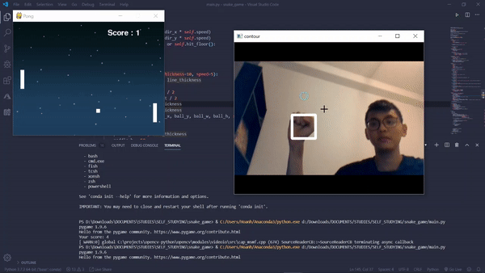

# Ping pong with OpenCV

## Description

This is a ping pong game that recognizes player's fist gestures to play that I programmed during my highschool. 

## How to install

STEP 1: Clone the project

```
git clone https://github.com/hoanhle/Snake-Game-OpenCV
```

STEP 2: Download [python3](https://www.python.org/downloads/)

STEP 3: Download necessary packages: 

```
Necessary packages: opencv-python, pygame, sys, numpy
```

STEP 4: Enjoy the game!


## Game capture

A short gif to describe how to play the game



## Support

Further support and information can be provided through this email address: <i>hoanhle100100@gmail.com</i>

## Author and acknowledgement

Tampere Universities | Science and Engineering | ICT/Maths/Machine Learning\
Hoanh Le


